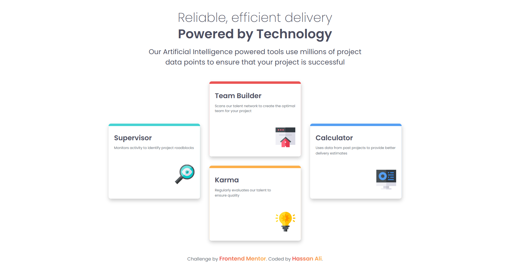
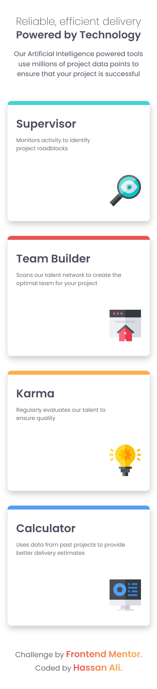

# Frontend Mentor - Four Card Feature Section Solution  

This is my solution to the [Four Card Feature Section](https://www.frontendmentor.io/challenges/four-card-feature-section-weK1eFYK) challenge on Frontend Mentor.  
Frontend Mentor challenges help you practice building realistic, production-ready layouts.  

---

## 📌 Overview  

### 🔹 The Challenge  
Users should be able to:  
- View the **four feature cards** layout optimally depending on their device’s screen size.  
- See hover and focus states for interactive elements.  
- Experience a clean, semantic, and accessible card-based design.  

---

## 🖼️ Screenshots  

### Desktop  
  

### Mobile  
  

---

## 🌐 Live Demo  
👉 [View Live Demo](https://hassan-ali-byte.github.io/four-card-feature-section-master/)  

---

## ⚙️ My Process  

### Built With  
- ✅ Semantic **HTML5 markup** (`<header>`, `<main>`, `<section>`, `<article>`)  
- 🎨 **CSS custom properties** for theme colors and spacing  
- 📐 **Responsive units** (`em`, `rem`, `clamp`) and **mobile-first workflow**  
- ⚡ **Flexbox + Grid** for card alignment and responsiveness  

---

## 📚 What I Learned  

This challenge helped me improve in several key areas:  

- **CSS Styling with Pseudo-elements**  
  I practiced using the `::before` pseudo-element to create the colored top bars on each card.  
  This approach gave me more control compared to only using `box-shadow` and avoided issues with rounded corners.  

- **Responsive Layout**  
  Learned to combine **CSS Grid** for the main card arrangement and **Flexbox** inside cards for aligning content.  

---

## 🔗 Resources  
- [Josh Comeau – CSS Reset](https://www.joshwcomeau.com/css/custom-css-reset/)  
- [Kevin Powell – YouTube](https://www.youtube.com/@KevinPowell)  

---

## 👨‍💻 Author  

**Hassan Ali**  

- Frontend Mentor – [@hassan-ali-byte](https://www.frontendmentor.io/profile/hassan-ali-byte)  
- GitHub – [hassan-ali-byte](https://github.com/hassan-ali-byte)  

---

✨ Thanks for checking out my solution!  
Feedback and suggestions are always welcome 🙌  
